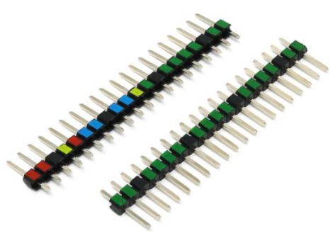

# Введение 

> autor @МатвейТ. 
> ред. @dng
> изображения. @dng

Изготовление печатных плат позволит устранить возможные проблемы с надежностью электрической и механической части проекта. конечным результатом работы будет печатная плат собственного производства с разъёмами компонентами и smd компонентами.

В данный момент применяются 2 метода изготовления плат. [Лазерно-Утюжная технология (ЛУТ)](PCB-LUD-Method/pcb-lud.md) и цепочка [proteus-copper-rhino](подготовка%20PCB%20proteus-copper-rhino.md). Обе технологии подробнее рассмотрены в советующих главах. в обоих случаях процесс начинается с создания печатной платы в proteus или его аналоге. 

## подготовка печатной платы proteus

### принципиальная схема

особенностью принципиальной схемы ptoreus для изготовления печатной платы являются "коннекторы". принципиальная схема для PCB не содержит (обычно) компонентов внешней обвязки. за исключением резисторов, диодов, конденсаторов, и иногда светодиодов и преобразователей.

список компонентов используемых чаще всего: 

| название                                        | имя в proteus                                                                                  | библиотека | компонент                               |
| ----------------------------------------------- | ---------------------------------------------------------------------------------------------- | ---------- | --------------------------------------- |
| коннектор GPIO                                  | CONN-SIL                                                                                       | CONNDVC    |                            |
| коннектор клеммного блока с винтовым зажимом | TBLOCK-M                                                                                       | CONNDVC    |                          |
| резистор (smd и tht версии)                     | res                                                                                            | devices    |                                         |
| диод (smd и tht версии)                         | diode                                                                                          | devices    |                                         |
| конденсатор (электролит)                        | cap-elec                                                                                       | devices    |                                         |
| линейный преобразователь ams1117                | ld1117s33 (для 3.3V) ld1117s50 (для 5V)  ld1117v33 ld1117v50 для высокомощных схем | analog     |       |
 
основные рекомендации к принципиальным схемам:
- все коннекторы с периферией должны быть подписаны названием или назначением периферии
- линии питания должны быть подключены к элементам gnd и vcc соответственно
- вертикально (или горизонтально) через схему должны проходить линии VCC и GND
- линии проводов должны быть подписаны
- не должно быть "диагональных" проводов
- схема должны помещаться на экране целиком, и при этом текст на схеме должен быть различим

допускается использовать "TERMINAL-DEFAULT" для соединения схемы, или подписывать провода при помощи "place-wire-label"

 

## Работа с PCB схемой 

> большинство размеров в proteus указываться в дюймах (in, th). для удобства в тексте приводятся дубликаты размера в дюймах и миллиметрах `40th (1мм)`

требования к печатной плате PCB
- ширина дорожек должна быть >0.6мм (24th)
- минимальный интервал между дорожками и контактными площадками составляет 0.5мм (20th)
- плата должна быть подписана названием проекта, автором и (опционально) годом создания
- текст должен быть жирным 
- размер контактных площадок (пинов) должен быть не менее С-90-40 (90th(2.25мм) - диаметр контактной площадки, 40th(1мм) - диаметр отверстия)
- на плате в зависимости от размера должно присутствовать от 1 до 4х отверстий крепления диаметром 3 или 5 миллиметра (винты М3 и М4)

формат шрифта и размер текста может быть любым, основное требование к тексту заключается в его "жирности", в ином случае текст может оказаться начитаем, рекомендуется использовать шрифт "**IMPACT**" или другой шрифт с эффектом жирности и высотой от 1.5in (3.75мм) 

минимальный интервал между дорожками и контактными площадками гарантирует отсутствие нежелательных контактов и замыканий. для удобства рекомендуется настроить правила дизайнера, в таком случает места опасных сближений будут автоматически подсвечены:

### экспорт прочие форматы

для последующей подготовки платы, PCB схему нужно либо экспортировать в GERBER формат для работы с  [copper-rhino](подготовка%20PCB%20proteus-copper-rhino.md) с помощью функции `menu->output->generate gerber file` . при экспорте в gerber, в разделе `layers\artworks` отмечаем для экспорта только Bottom Copper и Drill остальные слои не понадобятся.
либо производить печать в PDF для последующей печати в [ЛУТ](pcb-lud.md)

### работа с авторазводчиком

> не рекомендуется использовать авторазводчик proteus в связи с низким качеством его работы. вместо этого рекомендуется выполнять разводку в ручную или при помощи [TopoR](https://ru.wikipedia.org/wiki/TopoR)

перед запуском авторазводчика необходимо настроить clearance (см выше) и параметры "класса сети" (NET CLASS) в Design Rule manager.

## работа в CopperCam и Rhino

пошаговую инструкцию можно получить [здесь](подготовка%20PCB%20proteus-copper-rhino.md)