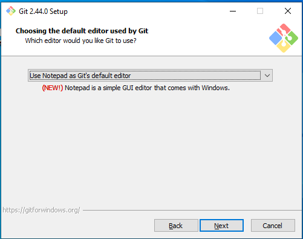
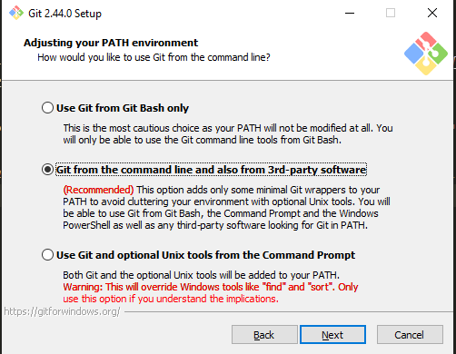

# Интрукция по установке и настройке GIT 

> Git (произносится «гит») — распределённая система управления версиями. Программа является свободной и выпущена под лицензией GNU GPL версии 2. По умолчанию используется TCP-порт 9418. 

> регистрация на [GitHub](github.com)

## установка GIT

гит можно установить скачать и установить по [ссылке](https://git-scm.com/downloads).
запускать установщик рекомендуеться от имени администратора.

при установке гит необходимо указать следующие варианты при установке:

- на этапе *chosing default editor used by git* выбрать `notepad` windows 
- на этапе *adjusting your path* указать `git from the command line...` 

остальные параметры можно оставить "по умолчанию".

проверить корректность установки git можно из консоли `git --version`

после установки git в консоли windows нужно указать параметры пользователя. следующимим командами:
```Bash
git config --global user.name "имя_пользователя_github"
git config --global user.email почта_github
```

## устранение проблем

1. что делать если при установке я забыл указать редактор по умолчанию?
редактор по умолчанию можно исменить с помощью `git config --global core.editor notepad`
2. что делать если при установке я забыл про этап с path?
Обратись к администратору или используй *git-bash*. *git-bash* представляет linux-подобный терминал. команды работы с git в нем аналогичны
3. что делать если git не работает из консоли?
см вопрос 2.

> вопосы принимаються к инструкции @shadow @dng @CH.

> подробнее про настройки git можно [прочитать здесь EN](https://git-scm.com/book/en/v2/Getting-Started-First-Time-Git-Setup)
> [или здесь RU](https://git-scm.com/book/ru/v2/%D0%92%D0%B2%D0%B5%D0%B4%D0%B5%D0%BD%D0%B8%D0%B5-%D0%9F%D0%B5%D1%80%D0%B2%D0%BE%D0%BD%D0%B0%D1%87%D0%B0%D0%BB%D1%8C%D0%BD%D0%B0%D1%8F-%D0%BD%D0%B0%D1%81%D1%82%D1%80%D0%BE%D0%B9%D0%BA%D0%B0-Git)
## настройка доступа к github репозиторию. ssh ssh-keygen

после установки git выполните в консоли команду `ssh-keygen`. (на данном этапе пригодяться знания ангилийского)
эта команда спросит у вас имя файла ssh. ничего не вводите и оставьте пустое поле для имени по умолчанию. после чего программа попросит придумать пароль для ключа ssh. при вводе пароля символы ***НЕ БУДУТ ОТОБРАЖАТЬСЯ*** в консоли, это нормально. введите пароль, затем подтвердите введя повторно.

> несмотря на возможность оставить пароль пустым. НЕ ДЕЛАЙТЕ этого

если все команда выполнена успешно. в папке `C:\users\<user>\.ssh\` будет сгенерированно два файла. *ssh-key* и *ssh-key.pub*. содержимое *ssh-key.pub* необходимо добавить на [странице безопасности github](#) <!-- TODO: для добавления ссылкаи нужно войти в аккаунт -->
