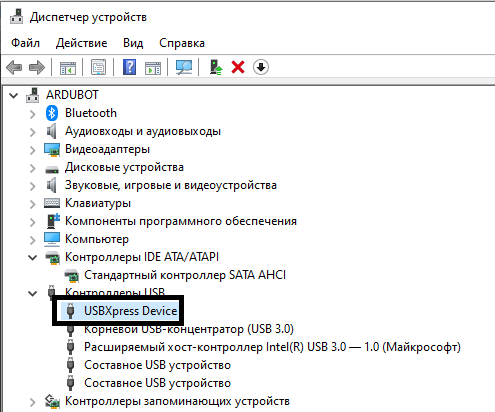
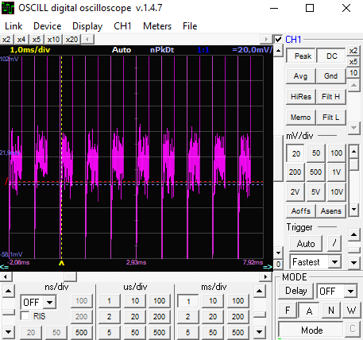
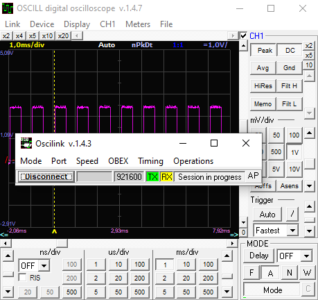
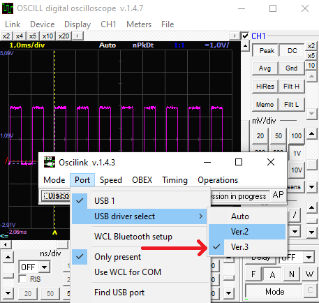

# инструкция для подключения и установки осциллографа

> Rev 1.1 (05.04)
> все материалы взяты [здесь](https://www.oscill.com/)
> страница с разными версиями ПО [злесь](https://www.oscill.com/rus/software/winosc/winoscdownl.html)

## установите драйвер
USB драйвер для осциллографа [здесь](https://www.oscill.com/files/silabs/dll.exe). драйвер являеться самораспаковывающимся архивом. [ссылка для офлайн](DISTR/dll.exe). *устанавливать от имени администратора*.
внимание! после установки драйвера осцилограф будет отображатсья как устройство USB -> USBXpress

## установите ПО
ПО для работы с осциллографом [здесь](https://www.oscill.com/files/oscilnew.zip), это Portable версия не требующая установки. ***ПРОСТО РАСПАКУЙТЕ АРХИВ В `C:\PORTABLE`***. [ссылка для офлайн](DISTR/oscilnew.zip) *запускать от имени администратора*. 
если при запуске ПО для работы появляеться ошибка, установите [msvbvm50](https://www.oscill.com/files/msvbvm50.exe) [ссылка для офлайн](DISTR/msvbvm50.exe)

после установки драйвера и запуска ПО выберите `menu -> link -> setup`, откроетсья окно настройки соединения.

затем в окне выберите `menu -> port -> USB driver select -> Ver. 3`. нажмите connect после чего можете закрыть окно настройки соединения.

# инструкция по работе с осциллографом

> написать и прикрепить скрин-схему для управления.